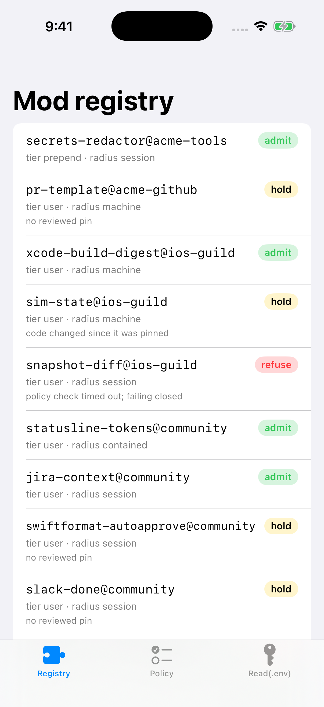
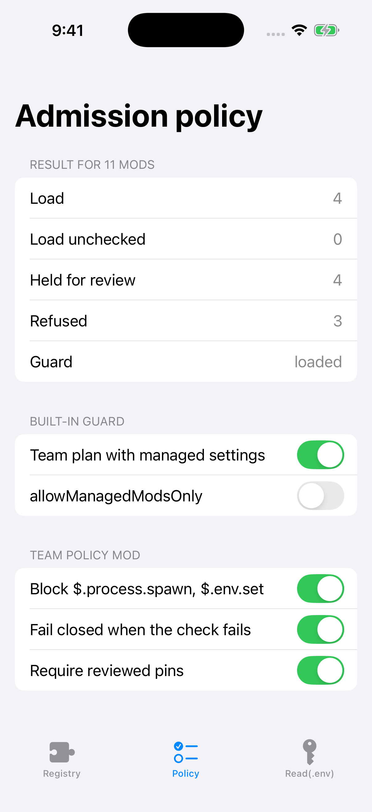

# ModAdmission: an admission gate for Claude Code mods

Article: [I Denied Read(.env). Six of the Ten Claude Code Mods I Loaded Could Still Read It.](https://medium.com/@er.rajatlakhina/i-denied-read-env-six-of-the-ten-claude-code-mods-i-loaded-could-still-read-it-a241338575a0)

Claude Code mods are TypeScript modules that run inside the agent with the installing user's permissions. They can see and rewrite every prompt and tool call, and they can approve or deny a tool call before a permission prompt appears. They have no sandbox. The built-in `sec-default` guard protects what your organization manages. It doesn't decide which of your engineers' mods are fine to run.

`ModAdmission` is a small Swift library that models that decision, plus an iOS demo app that runs it on a constructed registry of 11 mods for an iOS team:

- **Surface**: parses the `hooks:`, `calls:`, `env reads:` and `env writes:` lines that `claude plugin validate` prints. It classifies each call by reach (files, programs, network, secrets) and each hook by power (observes, rewrites, decides).
- **Provenance**: models when the guard loads (managed settings, or a Team/Enterprise plan) and which tier a mod runs in. A plugin enabled by managed settings but installed from GitHub still counts as a user's mod.
- **AdmissionGate**: the team policy a lead writes on top of the guard, as a policy mod in `prependPlugins`. It blocks calls, fails closed when the policy check throws or times out, requires reviewed SHA-256 pins, and holds machine-radius mods for review.
- **DenyCoverage**: shows which loaded mods can still reach what a `Read(.env)` deny rule protects. Deny rules cover Claude's tool calls, not a mod's own `$.fs` and `$.process` calls.



## What the sample registry shows

| Scenario | Load | Held | Refused | Mods that can still reach `.env` |
| --- | --- | --- | --- | --- |
| Team plan, guard loaded, a policy mod with an empty block list and no `.catch` | 10 (1 unchecked) | 0 | 1 | 6 of 10 |
| Same, with the lead policy below | 4 | 4 | 3 | 2 of 4 (the org's redactor and the reviewed, pinned build digester) |
| Personal plan, no managed settings, same no-op policy mod | 10 (1 unchecked) | 0 | 1 | 7 of 10 |

The registry is **constructed** (eleven plausible mods, stand-in code for the digests). It isn't a survey of real plugins. Tests pin every number in the table. The lead policy leaves `$.process.run` unblocked because the build digester needs it; the machine-radius rule makes it carry a reviewed pin instead.

```swift
public static let lead = TeamPolicy(
    blockedCalls: [ModCall("process.spawn"), ModCall("env.set")],
    failClosed: true,
    requirePins: true,
    reviewAtOrAbove: .machine
)
```

```swift
let gate = AdmissionGate(settings: SampleTeam.settings, plan: .team,
                         policy: .lead, pins: SampleTeam.pins)
let verdicts = gate.assess(SampleTeam.mods)          // admit / hold / refuse, with reasons
let exposed = DenyCoverage.exposures(rule: DenyRule("Read(.env)")!,
                                     assessments: verdicts,
                                     settings: gate.settings, plan: gate.plan)
```

## How to run it

```bash
git clone https://github.com/rajatslakhina/claude-code-mod-admission-article-demo.git
cd claude-code-mod-admission-article-demo
open Demo.xcodeproj
```

Pick an iPhone Simulator, then Build & Run (⌘R). No other setup is needed: the project consumes the library through a local package reference to this repo. The library alone builds and tests with `swift build` and `swift test`.

The Policy tab's toggles recompute the verdicts live. Launch arguments `-tab registry|policy|env` and `-preset default|lead` open a specific screen.

## Verification status

- `swift build -Xswiftc -warnings-as-errors` and `swift test` (26 XCTest cases) pass on Swift 6.1.2 (Linux) and on macOS in CI.
- The Simulator run happens in GitHub Actions (`macos-15`): `Scripts/simulator-screenshots.sh` builds `Demo.xcodeproj` with `xcodebuild`, installs it on an iPhone Simulator, and launches it 4 times with different launch arguments. After each launch it checks that the process is still alive after 8 seconds and saves a screenshot to `Demo/Screenshots/`. Nobody tapped through the UI by hand.



## Sources

- Claude Code docs, [Manage mods for your organization](https://code.claude.com/docs/en/plugins/mods/admin): the guard, tiers, `allowManagedModsOnly`, `prependPlugins`, deny-rule scope, fail-open `plugin.register` checks.
- [AlphaSignal](https://alphasignal.ai/news/anthropic-s-claude-code-mods-let-developers-rewrite-the-agent-from-inside) and [byteiota](https://byteiota.com/claude-code-mods-rewrite-the-agent-from-the-inside-out/) launch coverage.

MIT licensed.
